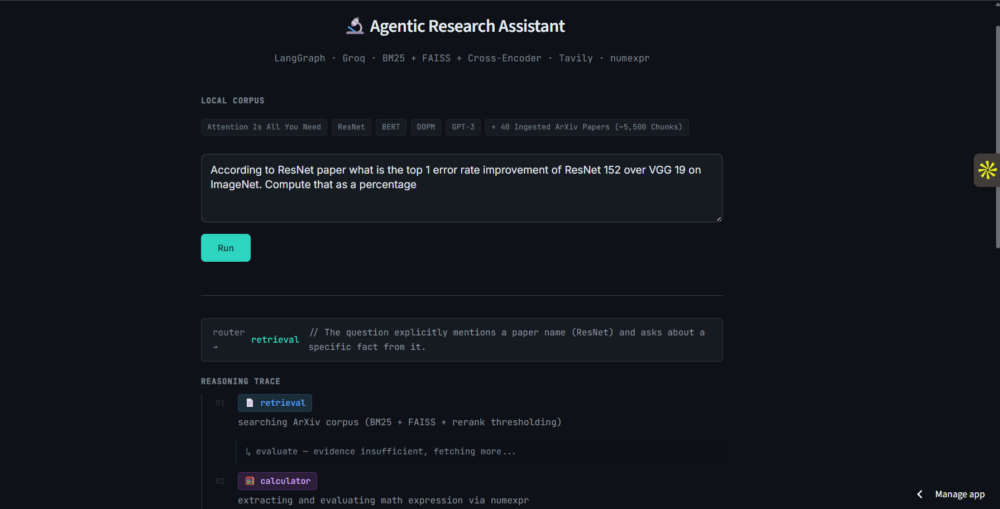
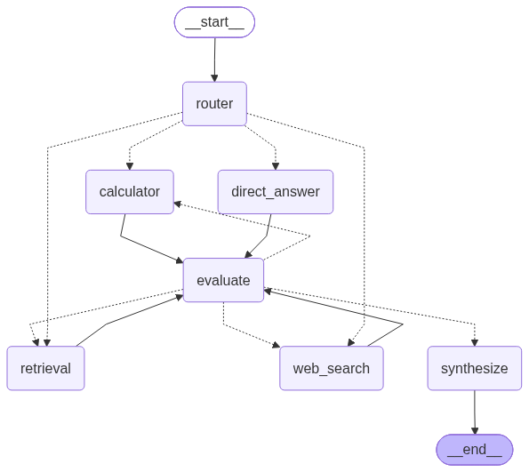
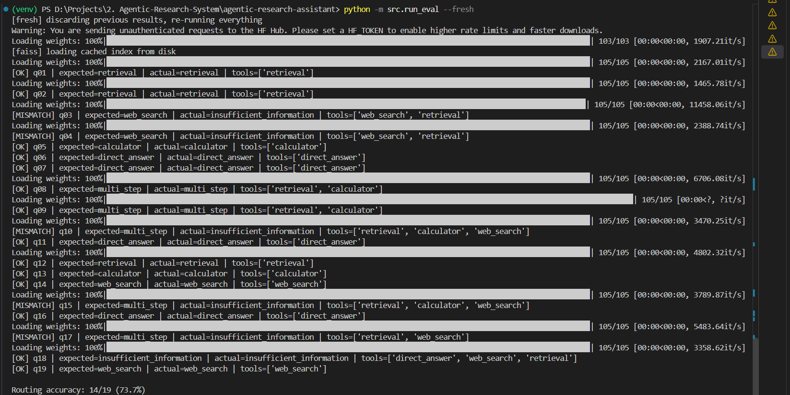
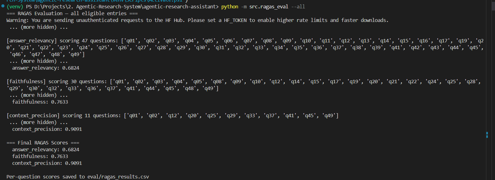

<h1 align="center">🔬 Agentic Research Assistant</h1>

<p align="center">
  
  
  
  
  
  
  
</p>

<p align="center">
<b>Production-grade self-correcting agent system</b> built with LangGraph over an ingested corpus of 45 ArXiv ML papers (~5,500+ chunks). Dynamically routes queries across hybrid vector search, Tavily web search, safe AST arithmetic evaluation, and direct answer synthesis. Features resilient Groq API key-rotation failover, a deterministic evaluator loop, streaming Streamlit UI, FastAPI endpoints, and containerized Docker deployment.
</p>

---

## 🚀 Live Demo & Key Documentation

| Resource | Link |
|---|---|
| 🎯 Interactive Streamlit UI | [agentic-research-assistant-k.streamlit.app](https://agentic-research-assistant-k.streamlit.app/) |
| 📘 Engineering Decisions & Architecture Trade-offs | [ENGINEERING_DECISIONS.md](ENGINEERING_DECISIONS.md) |

---

## 🖥️ Streamlit UI



---

## 🏗️ Architecture



The agent follows a cyclic state machine topology: **`START` → `router` → `tool` → `evaluate` → (loop or `synthesize`) → `END`**:

1. **Router Node** (openai/gpt-oss-20b) — classifies queries into `retrieval`, `web_search`, `calculator`, or `direct_answer` using Pydantic structured output.
2. **Tool Execution Nodes** — execute selected tools and append results to shared state (`Annotated[list, operator.add]`).
3. **Evaluate Node** (openai/gpt-oss-120b) — checks evidence sufficiency; routes to an untried tool if missing information, or forward to synthesis if sufficient. Capped at `MAX_EVIDENCE_STEPS=4` to prevent infinite execution loops.
4. **Deterministic Guardrails** — regex pre-checks for computation signals force the calculator when numerical expressions are retrieved, short-circuiting simple queries to prevent LLM over-escalation.
5. **Synthesize Node** — produces grounded answers; injects warning caveats if evidence was judged insufficient to neutralize hallucination.

**Key-Rotation Failover Strategy:** Built-in `RunnableWithFallbacks` automatically rotates across multiple Groq tokens (`GROQ_API_KEY1` → `GROQ_API_KEY2`), coupled with `tenacity` exponential backoff retries to eliminate `RateLimitError` quota crashes during high-volume batch evaluations.

---

## 📊 Evaluation & Benchmark Results

### 1. Routing Accuracy
* **50-Question Benchmark Suite:** **90.0% Routing Accuracy** (45 / 50 questions routed correctly).
* Evaluated across 6 target query types: single-hop paper retrieval, multi-step tool chains (`retrieval` + `calculator` / `web_search`), pure arithmetic, direct machine learning definitions, live web search, and unanswerable corpus queries.



---

### 2. RAGAS Quality Benchmark

Evaluated using GPT OSS 20B (`openai/gpt-oss-20b`) as judge over ground-truth annotated evaluation sets:
| Metric | Sample Size ($N$) | Mean Score | Median Score | Key Engineering Insight |
|---|---|---|---|---|
| **Context Precision** | 11 retrieval queries | **0.9091** | **1.0000** | Cross-Encoder reranking (`ms-marco`) + thresholding ($-2.5$ logit cutoff) ranks top relevant chunks at rank 1. |
| **Faithfulness** | 30 context queries | **0.7633** | **0.8167** | Grounded system prompt prevents parametric hallucinations during multi-step answer synthesis. |
| **Answer Relevancy** | 47 answer queries | **0.6824** | **0.8356** | High directness on core queries; mean reflects deliberate refusal paths on temporal 2026 missing-context queries. |



---

## 📡 API Reference & Endpoints

### `GET /health`

```json
{"status": "ok", "graph_loaded": true}
```

### `POST /query`

```bash
curl -X POST http://localhost:8000/query \
  -H "Content-Type: application/json" \
  -d '{"query": "What attention mechanism does the Transformer paper use?"}'
```

```json
{
  "final_answer": "The Transformer uses scaled dot-product attention...",
  "tools_used": ["retrieval"],
  "routing_reason": "Question asks about specific facts from an ML paper",
  "sufficient": true,
  "missing_info": ""
}
```

Interactive Swagger documentation is available at `http://localhost:8000/docs` when running FastAPI locally or inside Docker.

---

## 🔧 Tech Stack

| Layer | Technology |
|---|---|
| Agent Framework | LangGraph (StateGraph, conditional edges, `operator.add` accumulation) |
| LLM Engine | openai/gpt-oss-120b & openai/gpt-oss-20b via Groq API (Key Rotation Fallback) |
| Embeddings | `sentence-transformers/all-MiniLM-L6-v2` |
| Vector Store | FAISS CPU (Disk cached with SHA-256 `chunks.json` validation) |
| Keyword Search | BM25 (`rank-bm25`) |
| Retrieval Fusion | LangChain `EnsembleRetriever` (50/50 BM25 + FAISS) |
| Reranking & Filtering | Cross-Encoder (`ms-marco-MiniLM-L-6-v2`) with $-2.5$ logit score cutoff |
| Web Search | Tavily Search API |
| Calculator | `numexpr` (AST-parsed mathematical evaluator — safe from `eval()` injection) |
| Evaluation | RAGAS 0.2.x + custom benchmark suite |
| Backend API | FastAPI + Uvicorn |
| UI | Streamlit (Native node-level event streaming) |
| Containerization | Docker (Python 3.12-slim) |
| Deployment | Streamlit Community Cloud |

---

## 📄 Local Research Corpus

Ingested 45 ArXiv Machine Learning Papers (~5,500+ chunks) covering Transformer architectures, PEFT / LoRA fine-tuning, diffusion probabilistic models, and optimization.

**Section-Aware Chunking:** Uses custom header regex patterns in `src/ingest.py` to split papers into sections before chunking (`RecursiveCharacterTextSplitter`, size 800 / overlap 150), guaranteeing no chunk straddles section boundaries while retaining paper, author, page, and section metadata.

---

## ⚙️ Local Setup

```bash
# 1. Clone repository & setup virtual environment
git clone https://github.com/kforkandarp/agentic-research-assistant.git
cd agentic-research-assistant
python -m venv venv

# PowerShell (Windows):
.\venv\Scripts\Activate
# Linux / macOS:
source venv/bin/activate

# 2. Install dependencies
pip install -r requirements.txt

# 3. Configure Environment Variables (.env)
GROQ_API_KEY1=your_primary_groq_key
GROQ_API_KEY2=your_secondary_groq_key
TAVILY_API_KEY=your_tavily_key

# 4. Ingest Corpus & Build FAISS Index
python -m src.ingest

# 5. Run Streamlit UI
streamlit run app.py

# 6. OR Run FastAPI Backend
uvicorn main:app --host 0.0.0.0 --port 8000 --reload
```

---

## 🐳 Docker Containerization

```bash
# Build Docker image
docker build -t agentic-research-assistant .

# Run container (FastAPI on port 8000)
docker run -p 8000:8000 --env-file .env agentic-research-assistant
```

---

## 📄 License

MIT