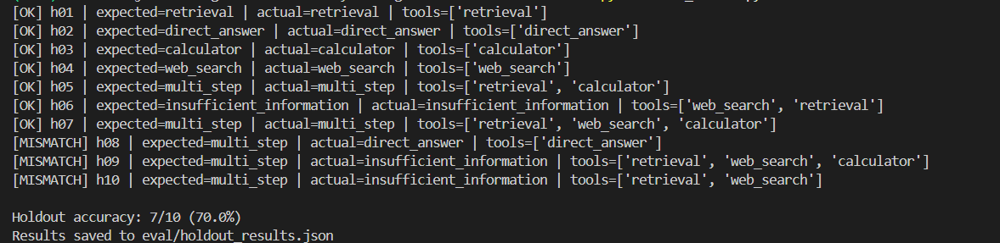

<h1 align="center">🔬 Agentic Research Assistant</h1>

<p align="center">
  
  
  
  
  
  
  
</p>

<p align="center">
<b>Self-correcting single-agent LangGraph system</b> that routes queries across hybrid retrieval, web search, calculator, and direct answer — over a corpus of 5 foundational ArXiv ML papers. Features a deterministic evaluate loop, streaming Streamlit UI, production FastAPI wrapper, and a Dockerized deployment.
</p>

---

## 🚀 Live Demo

| Resource | Link |
|---|---|
| 🎯 Interactive Streamlit UI | [agentic-research-assistant-k.streamlit.app](https://agentic-research-assistant-k.streamlit.app/) |


---

## 🖥️ Streamlit UI


---

## 🏗️ Architecture


The agent follows a **router → tool → evaluate → (loop or synthesize)** pattern:

1. **Router** (LLaMA 3.1 8B) — classifies the query into `retrieval`, `web_search`, `calculator`, or `direct_answer`
2. **Tool nodes** — execute the selected tool and append results to shared state
3. **Evaluate node** (LLaMA 3.3 70B) — grades evidence sufficiency; routes back to an untried tool if insufficient, or forward to synthesis if sufficient
4. **Deterministic guardrails** — regex detects computation signals, prevents tool repetition, enforces `MAX_EVIDENCE_STEPS=4` hard cap
5. **Synthesize node** — produces a grounded answer; injects a caveat into the system prompt when evidence was judged insufficient to prevent hallucination

**Model tiering:** Router is simple 4-class classification — 8B handles it correctly every time. Evaluator requires multi-step reasoning over accumulated evidence — 8B failed harder cases, so 70B is used there and for synthesis.

---

## 📊 Evaluation Results

### Routing Accuracy

| Set | Correct | Total | Accuracy |
|---|---|---|---|
| **Eval set** | 14 | 19 | **73.7%** |
| **Holdout set** | 7 | 10 | **70.0%** |




Misses are concentrated in two honest failure patterns — not hallucinations. Corpus gap questions (ResNet/VGG-19 cross-paper comparisons) correctly return `insufficient_information` rather than fabricating. Multi-step chains occasionally hit Groq free-tier rate limits before completing.

### RAGAS Quality Metrics

| Metric | Score | Eligible Questions |
|---|---|---|
| **Answer Relevancy** | **0.903** | 12 of 14 |
| **Faithfulness** | **0.651** | 8 |
| **Context Precision** | **0.667** | 3 |

> Answer Relevancy excludes 2 entries where the agent correctly refused to answer — these score 0.0 by RAGAS design. The 0.903 reflects actual answer quality on questions the agent did answer. Evaluated using LLaMA 3.3 70B as judge.

---

## 🚢 Deployment

**Streamlit Community Cloud** — the Streamlit UI (`app.py`) is deployed publicly with node-level streaming so each tool firing appears in real time.

**FastAPI** — `main.py` wraps the same LangGraph agent and exposes `GET /health` and `POST /query`. The graph is built once at startup via FastAPI's `lifespan` context, Pydantic models validate all requests and responses, and structured error handling ensures raw tracebacks never reach the caller. Verified locally — `/health` returns `graph_loaded: true`, `/query` returns structured JSON with `final_answer`, `tools_used`, `routing_reason`, `sufficient`, and `missing_info`.

**Docker** — the FastAPI app is fully Dockerized (Python 3.12-slim) and verified end-to-end locally with the agent running inside the container. HuggingFace Spaces Docker SDK now requires a paid subscription, so the public demo runs on Streamlit Cloud instead. The Docker image remains the artifact for any container-based deployment.

---

## 📡 API Reference

### `GET /health`
```json
{"status": "ok", "graph_loaded": true}
```

### `POST /query`
```bash
curl -X POST http://localhost:8000/query \
  -H "Content-Type: application/json" \
  -d '{"query": "What attention mechanism does the Transformer paper use?"}'
```

```json
{
  "final_answer": "The Transformer uses scaled dot-product attention...",
  "tools_used": ["retrieval"],
  "routing_reason": "Question is about specific facts from the local corpus",
  "sufficient": true,
  "missing_info": ""
}
```

Interactive docs at `http://localhost:8000/docs` when running locally.

---

## 🔧 Tech Stack

| Layer | Technology |
|---|---|
| **Agent Framework** | LangGraph (StateGraph, conditional edges, operator.add accumulation) |
| **LLM — Router** | LLaMA 3.1 8B via Groq API |
| **LLM — Eval + Synthesis** | LLaMA 3.3 70B via Groq API |
| **Embeddings** | all-MiniLM-L6-v2 (Sentence Transformers) |
| **Vector Store** | FAISS (CPU) |
| **Keyword Search** | BM25 (rank-bm25) |
| **Retrieval Fusion** | LangChain EnsembleRetriever |
| **Reranking** | ms-marco-MiniLM-L-6-v2 (Cross-Encoder) |
| **Web Search** | Tavily API |
| **Calculator** | numexpr (safe arithmetic — no eval()) |
| **Evaluation** | RAGAS + custom routing accuracy framework |
| **Observability** | LangSmith |
| **API** | FastAPI + Uvicorn |
| **UI** | Streamlit (node-level streaming) |
| **Containerization** | Docker (Python 3.12-slim) |
| **Deployment** | Streamlit Community Cloud |

---

## 📄 Local Corpus

725 chunks across 5 foundational ML papers, section-aware chunked (no chunk straddles a section boundary):

| Paper | Sections |
|---|---|
| Attention Is All You Need | 9 |
| ResNet | 7 |
| BERT | 7 |
| DDPM | 8 |
| GPT-3 | 11 |

---

## ⚙️ Local Setup

```bash
# Clone and install
git clone https://github.com/kforkandarp/agentic-research-assistant.git
cd agentic-research-assistant
python -m venv venv && venv\Scripts\activate
pip install -r requirements.txt

# Create .env
GROQ_API_KEY=your_groq_key
TAVILY_API_KEY=your_tavily_key
LANGCHAIN_API_KEY=your_langsmith_key
LANGCHAIN_TRACING_V2=true
LANGCHAIN_PROJECT=agentic-research-assistant

# Chunk your PDFs (add them to data/raw_pdfs/ first)
python -m src.chunking

# Run Streamlit UI
streamlit run app.py

# OR run FastAPI
uvicorn main:app --host 0.0.0.0 --port 8000
```

---

## 🐳 Docker

```bash
# Build
docker build -t agentic-research-assistant .

# Run (PowerShell)
docker run -p 8000:7860 --env-file .env -v "${PWD}/data:/app/data" agentic-research-assistant

# Run (CMD)
docker run -p 8000:7860 --env-file .env -v "%cd%/data:/app/data" agentic-research-assistant
```

---

## 🔮 Future Improvements

- **HuggingFace Spaces** — deploy Docker image once on a paid plan for a public API endpoint
- **Load testing** — k6/Locust benchmarks against FastAPI reporting p50/p95 latency
- **Streaming FastAPI** — WebSocket or SSE endpoint for token-level streaming via REST
- **FAISS persistence** — pre-build and store the index to eliminate cold-start rebuild
- **Larger RAGAS judge** — re-run evaluation with GPT-4o for more reliable scores
- **Expand eval set** — current 19 questions sufficient for development; expand to 50+ for production confidence
- **Multi-corpus support** — extend beyond fixed 5 papers to user-uploaded PDFs

---

## 📄 License

MIT
